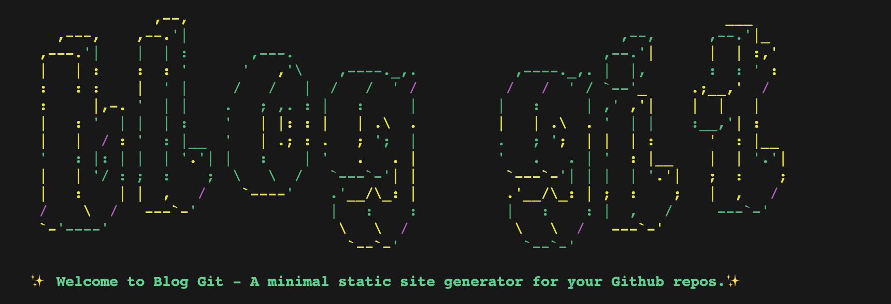
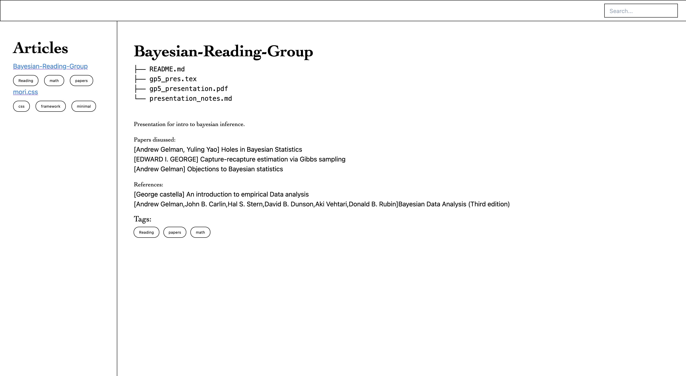
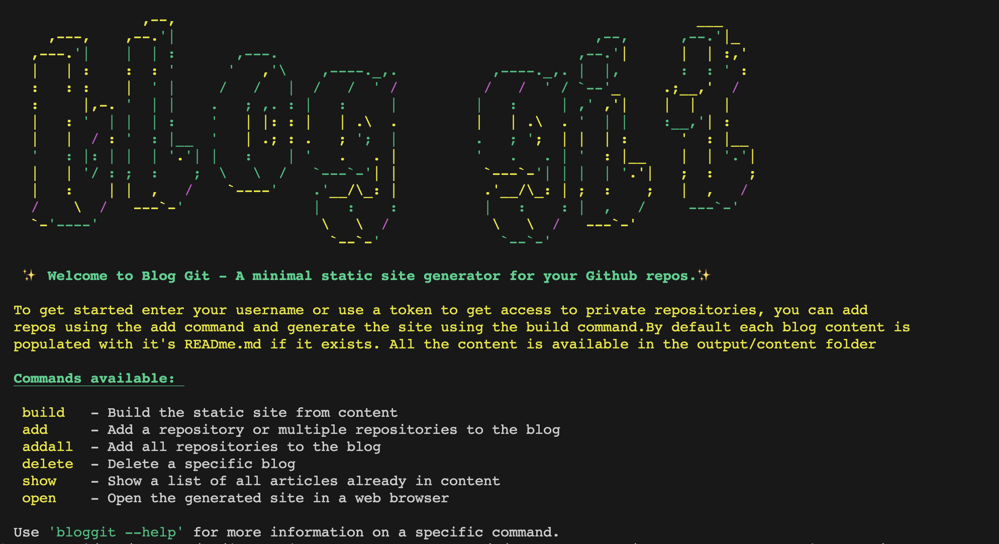

# Blog Git
A minimal static site generator for your Github repos


[]()

BlogGit is a command-line static site generator that allows users to create personal blogs from their GitHub repositories. It fetches repository information and converts it into a static HTML site and is designed with tailwindCSS.

[]()

## Screenshots

[]()
[]()


## Getting Started

1. Install from Pip 

```bash
```

2. Get a github access token, see github docs to get an access token https://docs.github.com/en/authentication/keeping-your-account-and-data-secure/managing-your-personal-access-tokens#creating-a-personal-access-token-classic 

3. To add a repo to your blog 

```bash
bloggit --<token> add <repository_name> 
```
This wil get your repo README.md  contents and store them in the content folder, to make css/html changes you can 
go to the content folder

4. To build your blog from the content folder

```bash
bloggit build
```
This will create your blog in a single html file called index.html
5.  To open your new blog do 

```bash
bloggit open
```


## Usage 
```
# To build the static site from content
bloggit build

# To add a repository to the blog
bloggit --<token> add <repository_name>

# To delete a specific blog
bloggit delete <blog_name>

# To show a list of all articles
bloggit show

# To open the generated site in a web browser
bloggit open
```


## Features 

- Easy-to-use command-line interface.
- Integrates with GitHub to fetch repository data.
- Generates a static HTML site that can be hosted anywhere.
- Each repo is it's own HTML file (output/contents folder) so it can be easily customizable.

